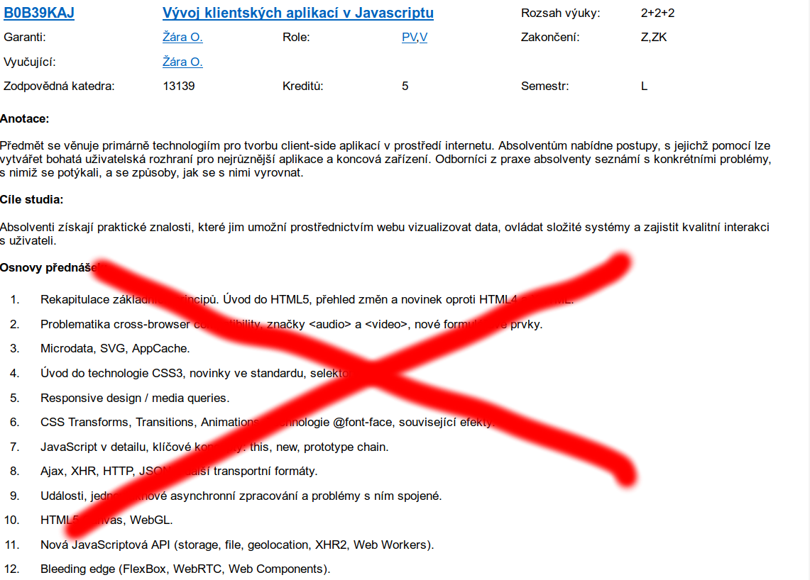

# KAJ

...

---

# Obsah

  1. O předmětu
  1. Kompatibilita napříč prohlížeči
  1. JavaScript pro středně pokročilé
  1. Vybrané partie DOM API

---


# Co jsou JavaScriptové aplikace?

  - SPA – Single Page Application
  - <a href="http://www.mapy.cz">www.mapy.cz</a>
  - <a href="http://www.gmail.com">www.gmail.com</a>
  - <a href="https://epicport.com/en/ttd">OpenTTD online</a>
  - tato stránka
  - ...a mnohé další

---


# Představení předmětu

  - "Moderní" webové technologie na klientu
  - HTML5, CSS3, JavaScript
  - <a href="img/ppk.jpg"></a>


---


# Organizace

  - Klasifikovaný zápočet či zkouška
  - Semestrální práce
  - Přednášky: RNDr. Ondřej Žára, Seznam.cz
  - Cvičení: Bc. Zdeněk Vlach, Seznam.cz
  - Cvičení: Bc. Petr Huřťák, <del>Seznam.cz</del>

---

# Podklady a materiály

  - <a href="https://developer.mozilla.org/">https://developer.mozilla.org/</a>
  - <a href="http://caniuse.com/">http://caniuse.com/</a>
  - Google
  - <del>Stack Overflow</del>
  - <a href="mailto:ondrej.zara@firma.seznam.cz">ondrej.zara@firma.seznam.cz</a>

---


# Kniha


  - JavaScript – Programátorské techniky a webové technologie
  - Vydává <a href="http://www.albatrosmedia.cz/tituly/29109959/java-script/">cpress.cz</a>
  - Určeno pro zájemce o JavaScript po absolvování základního kurzu
  - Povětšinou jen JS, méně DOM rozhraní

---


# Sylabus předmětu

{style="height:600px"}

---


# Web předmětu

  - Stránky předmětu na <a href="http://cvut.seznam.cz/">cvut.seznam.cz</a>
  - (Nové) pořadí témat: JS, síť, CSS, multimédia

---

# Standard HTML5
https://html.spec.whatwg.org/

  -  +  (**W**eb **H**ypertext **A**pplication **T**echnology **W**orking **G**roup)
  - Mnoho rozdílných požadavků na standard:
	- Zpětná kompatibilita
	- Zpracování chyb
	- Jednoduchost použití
	- Podpora pro skriptování

---

# Standardizační proces
 {style="float:right;margin:0"}

  - Editor Ian Hickson
  - Aktuálně <del><em>Working Draft</em></del> <em>Recommendation</em>
  - <em>Living standard</em>
  - téměř 9MB textu, 85k řádek
  - Vývoj pomocí mailinglistu <a href="mailto:whatwg@whatwg.org">whatwg@whatwg.org</a>
  - <em>Dozorčí rada</em> (WHATWG members)
  - 2004 – <del>2022</del> 2014
	</ul>

---

# Webové prohlížeče

<table style="margin:0">
	<thead>
		<tr>
			<td>Jméno</td><td>Verze</td><td>Renderer</td><td>JavaScript</td><td>Poznámka</td>
		</tr>
	</thead>
	<tbody>
		<tr>
			<td>Mozilla Firefox</td><td>65</td><td>Gecko</td><td><em>Spider</em>Monkey</td><td></td>
		</tr>
		<tr>
			<td>Google Chrome</td><td>72</td><td>Blink/WebKit</td><td>V8</td><td></td>
		</tr>
		<tr>
			<td>Apple Safari</td><td>12</td><td>WebKit</td><td>JSC</td><td>Existovala verze pro Windows</td>
		</tr>
		<tr>
			<td>Microsoft Internet Explorer</td><td>11</td><td>Trident</td><td>Chakra</td><td>Zajímavý až od verze 9</td>
		</tr>
		<tr>
			<td>Microsoft Edge</td><td>18</td><td>EdgeHTML</td><td>Chakra</td><td></td>
		</tr>
		<tr>
			<td>Opera</td><td>12/55</td><td>Presto/Blink</td><td>Carakan/V8</td><td></td>
		</tr>
	</tbody>
</table>

---

# Webové prohlížeče: mobilní
  - Apple Mobile Safari (iOS)
  - Android Browser (Android)
  - Opera Mobile (Android, Symbian, Windows Mobile)
  - Firefox for Android (Android)
  - Chrome for Android (Android, trošičku iOS)
  - Internet Explorer Mobile (Windows Mobile)

---

# Webové prohlížeče: zpětná kompatibilita
  - Nutnost definovat podporovaný <em>feature set</em>
  - Oříznout starý prohlížeč znamená připravit se o uživatele
  - Oříznout starý prohlížeč znamená motivovat k upgrade
  - Časté aktualizace = snazší rozhodování

---


# Webové prohlížeče: co kdo umí

  - https://caniuse.com/
    - Srovnávací tabulky
    - Odkazy na testy
  - [Mozilla Developer Network](https://developer.mozilla.org/cs/)
    - Dokumentace
    - Ukázky
  - [Feature detection](http://diveintohtml5.info/detect.html)

---

# Volitelné nabízení pokročilých technologií

  - **Progressive enhancement:** nabízet základní funkcionalitu a volitelně přidávat
  - **Graceful degradation:** nabízet pokročilou funkcionalitu a v případě nouze couvnout

---

# Polyfill

**Polyfill:** JavaScriptový kód, který je schopen doplnit chybějící funkcionalitu při zachování kompatibilního API

```js
if (!("onhashchange" in window)) {
	var oldHash = window.hash;
	setInterval(function() {
		if (window.hash == oldHash) return;
		oldHash = window.hash;
		if (window.onhashchange) window.onhashchange();
	}, 100);
}
```

---

# JavaScript pro středně pokročilé
  - Očekáváme znalost na úrovni základního kurzu (proměnná, funkce, `querySelector`, `addEventListener`)
  - Pokročilé partie jazyka nás čekají příště
  - Co zbývá: console API, iterace, IIFE

---

# JS: console API

Vývojářské nástroje v každém prohlížeči (typicky <kbd>F12</kbd>)

```js
console.log("...");
console.log("test", 123, ["pole", "hodnot"]);
console.log("Formatovani %s", "retezcu");

console.warn("warning");
console.error("crash");

console.time("test");
console.timeEnd("test");
```

Více info v [kompletní dokumentaci](https://developer.mozilla.org/en-US/docs/Web/API/Console).

---

# JS: iterace struktur/objektů

```js
var data = {
	jmeno: "Eva",
	prijmeni: "Stará",
	vek: 74
};

for (var p in data) {
	console.log(p); // "jmeno", "prijmeni", "vek"
}
```

---

# JS: iterace polí

```js
var data = [15, "babicka", true];

// spravne
for (var i=0; i<data.length; i++) {
	console.log(i); // 0, 1, 2
	console.log(data[i]); // 15, "babicka", true
}

// spatne – ale proc?
for (var p in data) {
	console.log(p); // 0, 1, 2
}
```

---

# JS: iterace polí

  - Cyklus `for-in` *občas* funguje
  - Ale někdy vyústí v nečekané (nesprávné) výsledky
  - Jde totiž o výčet klíčů &rArr; a těch může být jiný počet, než hodnot
     - *sparse arrays:* `new Array(10)`
     - obohacená pole: `Array.prototype.X = ...`

---


# JS: funkcionální iterace

  - Přístup známý z tzv. funkcionálního programování
  - Aplikace uživatelem zadané funkce na (některé) položky pole
  - V řadě případů kratší / expresivnější zápis
  - Obliba použití roste s ES6 (třetí přednáška)
  - Kompletní <a href="https://developer.mozilla.org/en-US/docs/Web/JavaScript/Reference/Global_Objects/Array#Iteration_methods">dokumentace na MDN</a>

---


# JS: funkcionální iterace I

```js
var data = [15, "babicka", true];

/* anonymni funkce */
data.forEach(function(item, index) {
	console.log(item); // 15, "babicka", true
});

/* pojmenovana funkce */
function log(item, index) {
	console.log(index);
}
data.forEach(log); // 0, 1, 2
```

---

# JS: funkcionální iterace II

```js
var data = [1, 2, 3];

function square(x) { return x*x; }
var data2 = data.map(square); // 1, 4, 9

function odd(x) { return x % 2; }
var data3 = data.filter(odd); // 1, 3
```

---

# JS: funkcionální iterace III

```js
var data = [1, 2, 3];

function odd(x) { return x % 2; }
data.every(odd);  // false
data.some(odd);   // true

function add(x, y) { return x+y; }
data.reduce(add); // 6
```

---

# JS: IIFE

  - Problém: strukturování (modularizace) JS kódu
  - Historicky velká ostuda
  - Solidní řešení až v ES6 (třetí přednáška)
  - Více HTML značek `<script>` sdílí jmenný prostor
  - Trik: immediately-invoked function expressions

---

# JS: IIFE
```js
(function(){
	var document = "test"; // lokalni promenna
	alert(document);       // "test"
})();

alert(document);           // [object HTMLDocument]
```

---

# Vybrané partie DOM API

  - Funkce, konstanty a objekty pro manipulaci se stránkou
  - Zpravidla dostupné pomocí (globální) proměnné `document`
  - John Resig: <a href="http://ejohn.org/blog/the-dom-is-a-mess/">The DOM is a mess</a>

---

# DOM: úpravy podstromu

```js
var p = document.querySelector("p");

/* HTML parser, pozor na XSS! */
p.innerHTML = "<strong>toto je test</strong>";

/* jen text */
p.textContent = "<strong>toto je test</strong>";
```

---

# DOM: tvorba nových prvků

```js
var p = document.querySelector("p");

var strong = document.createElement("strong");
p.appendChild(strong);

var text = document.createTextNode("toto je test");
p.appendChild(text);

var input = document.createElement("input");
input.type = "number";
input.id = "foo";
```

---

# DOM: práce s atributem `class`

```js
var p = document.querySelector("p");

p.className = "class1";

p.classList.add("class2");
p.classList.remove("class3");
p.classList.contains("class2"); // true

p.classList.toggle("class4");
p.classList.toggle("class4", x > 15);
```

---

# Prostor pro otázky

? { .questions }
